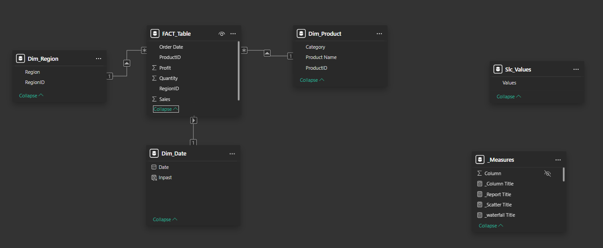
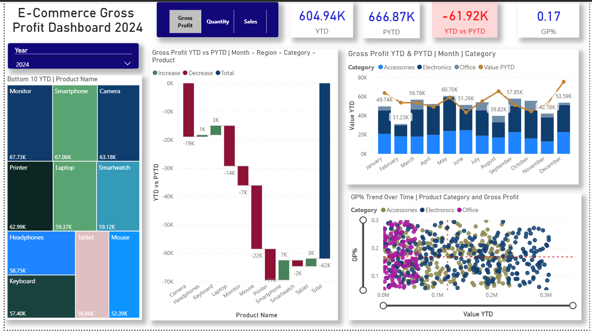
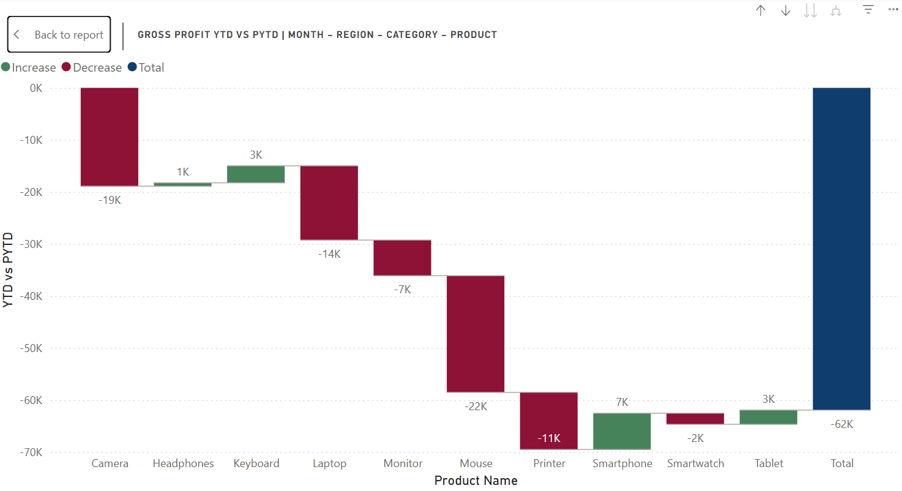
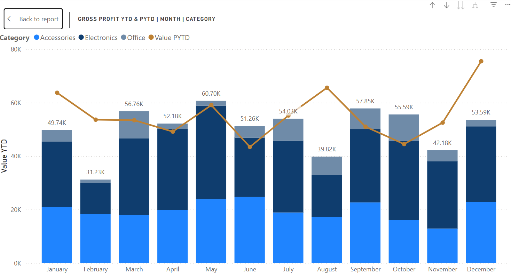
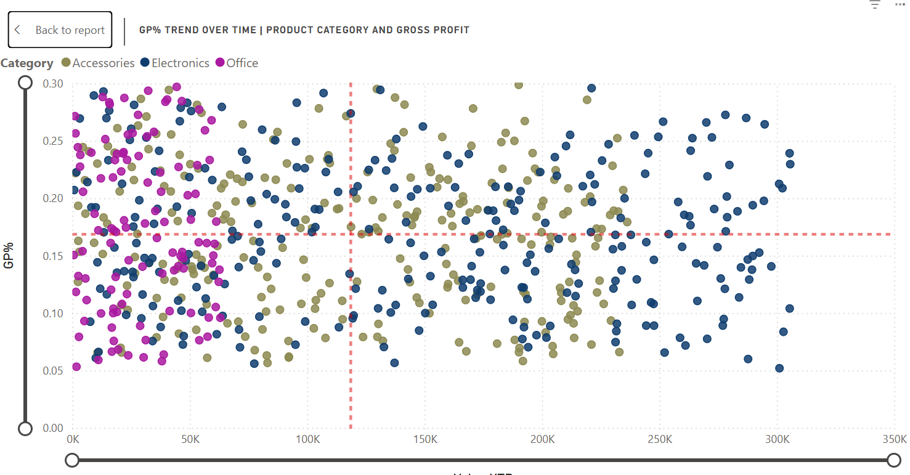
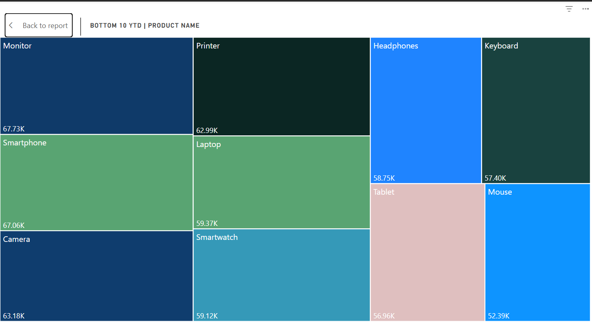

# ecommerce-sales-performance-and-time-Intelligence-dashboard-PowerBI
This project presents an interactive Power BI dashboard designed to analyze and monitor e-commerce sales performance across products, regions, and time.  The dashboard leverages advanced data modeling and time intelligence techniques to provide actionable insights into business performance.

## 🧱 Data Modeling

A structured data modeling approach was implemented to ensure efficient analysis and accurate reporting within the dashboard.

### ⭐ Star Schema Design

The model follows a **star schema architecture**, consisting of:

* **Fact Table**

  * Contains transactional data:

    * Sales
    * Quantity
    * Profit
    * Order Date

* **Dimension Tables**

  * **Date Dimension (`Dim_Date`)**

    * Custom-built using a calendar table
    * Enables time intelligence calculations (YTD, PYTD)
  * Additional dimensions:

    * Product Name
    * Product Category
    * Region

This structure allows for efficient filtering, aggregation, and scalability.

### 🔗 Relationships

* A **one-to-many relationship** exists between:

  * `Dim_Date[Date]` → `FACT_Table[Order Date]`

* Dimension tables filter the fact table, enabling:

  * Accurate slicing by time, region, and category
  * Seamless drill-down across visuals

### ⏳ Time Intelligence Support

The custom Date table plays a critical role in enabling time-based analysis:

* Supports:

  * Year-to-Date (YTD)
  * Previous Year-to-Date (PYTD)
* Ensures proper alignment of time periods for meaningful comparisons

### ⚙️ Design Considerations

* Measures were used instead of calculated columns for flexibility and performance
* Dynamic measure switching was implemented using a dedicated slicer table
* The model was optimized to avoid unnecessary dependencies and ensure consistent calculations across visuals

### 💡 Outcome

This data model enables:

* Fast and efficient query performance
* Accurate time-based comparisons
* Scalable and maintainable dashboard design

👉 Overall, the model provides a strong foundation for advanced analytics and interactive reporting.

## 📊 Dashboard Analysis & Key Insights

This dashboard provides an interactive analysis of e-commerce performance using Year-to-Date (YTD) and Previous Year-to-Date (PYTD) comparisons across products, regions, and time.

## 📌 KPI Overview

The dashboard highlights key performance metrics:

| Year | YTD Gross Profit | PYTD Gross Profit | YTD vs PYTD |
| ---- | ---------------- | ----------------- | ----------- |
| 2022 | 572,856.98       | 0                 | +572,856.98 |
| 2023 | 666,866.42       | 572,856.98        | +94,009.44  |
| 2024 | 604,941.81       | 666,866.42        | -61,924.61  |

### 💡 Insight:

* Strong growth from **2022 → 2023 (+94K)**
* Decline in **2024 (-61K)** indicating potential performance issues

## 📊 Dashboard Overview

## 📊 Waterfall Chart

### Gross Profit YTD vs PYTD | Month - Region - Category - Product

### 💡 Insight:

* Identifies **key drivers of profit change between years**
* Highlights:

  * Categories or regions contributing to growth (2023 increase of +94K)
  * Declines in 2024 (-61.9K), showing where performance dropped

### 🔍 Analytical Value:

* Enables **root cause analysis**
* Supports drill-down into:

  * Month → Region → Category → Product

## 📈 Line & Stacked Column Chart

### Gross Profit YTD & PYTD | Month | Category

### 💡 Insight:

* 2023 shows **consistent growth over 2022**
* 2024 reveals **declining trend compared to 2023**
* Electronics category contributes significantly across periods

### 🔍 Analytical Value:

* Identifies **seasonality and category performance trends**
* Supports comparison of **monthly performance over time**

## 📉 Scatter Plot

### GP% Trend Over Time | Product Category and Gross Profit

### 💡 Insight:

* Profitability varies across categories:

  * 🟢 Accessories → relatively stable margins
  * 🔵 Electronics → higher contribution but fluctuating margins
  * 🌸 Office → moderate performance

* Indicates that:

  * Growth is not only volume-driven
  * Profit efficiency (GP%) varies across categories

### 🔍 Analytical Value:

* Helps assess **margin efficiency vs sales performance**
* Highlights **high-margin vs high-volume trade-offs**

## 🗺️ Treemap

### Bottom 10 YTD | Product Name

### 💡 Insight:

* Products such as:

  * Monitor (~67.73K)
  * Smartphone (~67.06K)
  * Keyboard (~57.40K)

* Show relatively close performance levels

👉 Despite being labeled “Bottom 10”:

* No extreme underperformance observed
* Indicates a **balanced product portfolio**

## 🎛️ Filters & Interactivity

The dashboard includes:

* **Year slicer** → Enables comparison across 2022, 2023, 2024
* **Metric selector** → Switch between:

  * Sales
  * Quantity
  * Gross Profit
* **Dynamic titles** → Update automatically based on selections

## 🧠 Overall Analytical Value

This dashboard enables:

* Year-over-Year comparison (YTD vs PYTD)
* Root cause analysis (waterfall chart)
* Profitability analysis (GP%)
* Multi-dimensional exploration (time, region, category, product)

## 🚀 Key Takeaways

* Business experienced **growth in 2023**, followed by a **decline in 2024**
* Profitability varies across product categories, not just sales volume
* No single product significantly underperforms, indicating stability
* Data-driven insights can guide **strategic decisions for growth and optimization**

## Author
Latifah Usaini Bashir - Data Science/ Analytics Enthusiast
